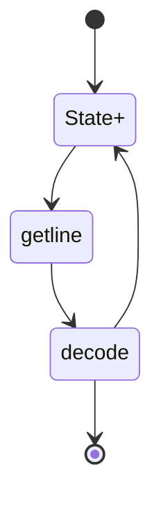

# C++ Basics (Incomplete)
## File Lecture
### Library:
We use the filestream library to work with textfiles:
```cpp
#include <iostream> // must be included
#include <fstream>  // allows reading and writing
#include <ifstream> // read only
#include <ofstream> // write only
#include <sstream>  // for reading strings (getline)
```
### Open and close a file:
```cpp
fstream file("myfile.txt"); // open() is automatically called
if(file.fail()) exit();     // exit if file doesn't exist
file.close();               // closes the file
```
### Remarks
- Opening a file in writing mode does delete the content. The mode **ofstream::app** must be used to write in the file.<br>
- A file can only be used by one instance at a time.<br>
- Only one file at a time can be opened by a program. 
### Read and write
It is possible to read in binary mode with the following functions:
```cpp
read();
write();
```
a such file cannot be read by humans.<br>
It is more convenient to read and write in formated mode:
```cpp
// the flots in and out must be defined:
float character;
in >> character;
out << character << endl;
```
If we include **sstream** it is also possible to get the whole line of a document:
```cpp
getline(filename, string); // returns true/false
getline(file >> ws, line); // filter the whitespaces
```
### Stringstream
C++ provides a type stringstream that is very useful to read data:
```cpp
int value;
istringstream data = line; // provides an input string
while(data >> value)    // takes only int values
    cout << value << endl;
```
### Read a configuration file
To read a configuration file (file that always has the same structure) it can be very helpful to implement a reading-statemachine:

We start at a certain state with an attended value and then go through the file by searching different values with the help of the different states. The best way to realize such a Statemachine is with a switch-statement. 
