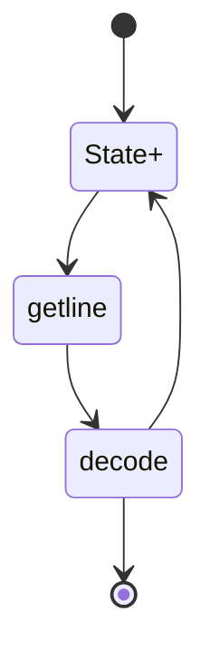

# C++ Basics
## Basic types
- **void**: empty type
- **int**: 32 bits integer
- **float / double**: 32 / 64 bits floating point number
- **char**: 8 bits character
- **bool** (boolean): 1 bit true/false (usually occupies 8 bits nevertheless)
- **short**: 16 bits integer

## Creating a variable
```cpp
// creation: type name; Attention, random value!
int i;
// creation and affectation: type name = value;
int i = 5; //alternative: int i(5);
```

## Constants
To create a constant, add **const** or **constexpr**
```cpp
constexpr int a = 5;
```

## Litteral numbers
Numbers without comma in code have the type **int**, numbers with comma are **double** otherwise we must add an f to precise that it is a **float**.

## Functions
```cpp
// return-type name(input values){function body}
int foo(int bar){
    return bar * bar;
}
```
If the return type is void, there is no need to use the return statement in the function body

# Input values
We can pass input values by value or by reference while indicating if their value changes in the function:
```cpp
int foo(const int& bar){} // no copy of bar, bar cannot be changed
int foo(int& bar){} // entered bar gets changed
int foo(int bar){} // entered bar does not change (local copy)
```

## Incrementation with ++
if we return a statement containing the **++ operator**, there are two variants:
```cpp
int i = 0;
return ++i; // pre-incremation returns 1
return i++; //post-incremation returns 0
```

## Conditions
```cpp
if(condition){
    // 1
}
else if(second_condition){
    // 2
else{
    // 3
}
```
If condition is true, the 1 code is executed, is condition is false **and** second_condition is true 2 gets done, only if both conditions are wrong 3 gets done

## Comparison operators
- **a == b**: returns true if a = b
- **a <= b**: returns true if a<= b...

## Ternary operator
```cpp
// condition ? val1 : val2
// returns val1 if condition is true and val2 otherwise
int i = a == b ? val1 : val2;
// is equivalent with:
int i;
if(a == b){
    i = val1;
}
else{
    i = val2;
}
```

## Lazy evaluation
If we connect statements with the keywords **and / or** we must consider the order of evaluation:
```cpp
if(a and b) // if a is false, b is ignored
if(a or b) // if a is true, b is ignored
```


## File Lecture
### Library:
We use the filestream library to work with textfiles:
```cpp
#include <iostream> // must be included
#include <fstream>  // allows reading and writing
#include <ifstream> // read only
#include <ofstream> // write only
#include <sstream>  // for reading strings (getline)
```
### Open and close a file:
```cpp
fstream file("myfile.txt"); // open() is automatically called
if(file.fail()) exit();     // exit if file doesn't exist
file.close();               // closes the file
```
### Remarks
- Opening a file in writing mode does delete the content. The mode **ofstream::app** must be used to write in the file.<br>
- A file can only be used by one instance at a time.<br>
- Only one file at a time can be opened by a program. 
### Read and write
It is possible to read in binary mode with the following functions:
```cpp
read();
write();
```
a such file cannot be read by humans.<br>
It is more convenient to read and write in formated mode:
```cpp
// the flots in and out must be defined:
float character;
file >> character;
file << character << endl;
```
If we include **sstream** it is also possible to get the whole line of a document:
```cpp
getline(filename, string); // returns true/false
getline(file >> ws, line); // filter the whitespaces
```
### Stringstream
C++ provides a type stringstream that is very useful to read data:
```cpp
int value;
istringstream data = line; // provides an input string
while(data >> value)    // takes only int values
    cout << value << endl;
```
### Read a configuration file
To read a configuration file (file that always has the same structure) it can be very helpful to implement a reading-statemachine:

We start at a certain state with an attended value and then go through the file by searching different values with the help of the different states. The best way to realize such a Statemachine is with a switch-statement. 