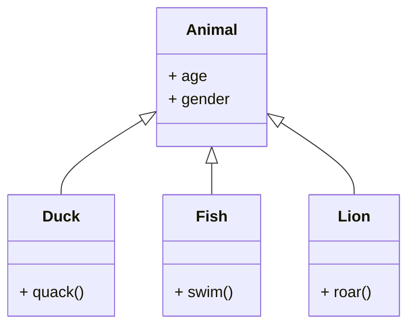

# OOP in C++

## Core Concepts of OOP
### OOP definition:
OOP means Object Oriented Programming i.e. the architecture of a program is decomposed in objects that follow four main principles:
### Encapsulation:
Mechanism of hiding of data implementation by restricting the access to functions and variables.
### Abstraction:
A problem is decomposed in abstract pieces (modules) that ar as independant from each other as possible. The user doesn't know about the implementation of functions inside a module.
### Inheritance:
Classes can inherit from higher level classes, that allows to reuse a lot of code.
### Polymorphism:
Elements can appear in several different forms.
***
<br>

## Class Notation
### Attributes and Methods:
An attribute is a variable (propertie of the class), a Method is a function that belongs to the class and can change attributes.<br>
Methods that don't change attributes should contain the expression const:
```cpp
void foo() const {}
```
### Private and Public:
Private: and public: are keywords to define the range of attributes and functions of a class. Private elements of a class are only knewn to other members of the class, public elements are known to everyone.
### Interface:
The Interface of a class (Class definition) with the prototypes of the methods go in the **header file** (.h).\
Example for a Header file (class definition):
```cpp
class Rectangle{
    private:
        //attributes
    public:
        //some functions
    private:
        //functions (class-internal use)
}; //Do not forget semicolon!
```
### Implementation:
The implementation of the methods as well as variables, that are not atributes of the class go into the ***.cc*** file (Namespace for variables). The interface of the class is included in the implementation with #include filename.
### Namespace
Each class has its generic namespace. If variables are defined in the ***.cc*** file, they must be part of the non-named namespace, otherwise they are global variables that everyone has access to.
Definition of a variable in the non-named namespace:
```cpp
namespace{
    int variable;
    void foo();
    //...
}
```
Another possibility is to add the keyword ***static*** in front of the definition.
### This Pointer:
A local variable can mask a variable on a higher level with the same name (e.g. function (method) parameter masks attribute of class) in this case we can use ***this-pointer*** to reach the level from which the function is called (class):
```cpp
private:
    int var; //attribute of class
public:
    void foo(int var){
        this->var = var; //access to the attribute
    }
```
***
<br>

## Constructors
Constructors are used to to generate instances of a class (i.e. Objects). Constructors are functions without return type.
### Syntax of constructors:
```cpp
class MyClass{
    MyClass(int a, int b)
    : attribute1(a), attribute2(b) //assignment of attributes
    {}  //body of constructor (validation)
}
```
### Default constructor:
It is possible to create constructors, that assign default values or no values to attributes:
```cpp
MyClass() : attribute(5) {}
```
### Default default constructor:
If no constructor is specified, the compiler generates automatically a constructor that generates a class but assigns no values at all.
It is possible to define manually a default default constructor like this:
```cpp
MyClass() = default;
```
### Remarks:
* A Constructor can call another constructor.
* It is possible to assign default values to attributes in the declaration of the class as well.
### Copy constructor:
Generates a copy of an object. Syntax:
```cpp
MyClass Copy_Name(Object);
```
this calls the standard copy constructor that automatically generates the new instance. A custom prototype is defined like:
```cpp
MyClass(MyClass const& item) : element(element) {}
```
Usually it is not necessary to define a custom copy constructor. But there are cases where it is very important to define a custom copy constructer e.g. a counter keeps track of the number of objects of an instace. This counter must be incremented by the copy constructer as well as by the constructor.<br>
To avoid the copy of an Object, add ***= delete;*** behind the custom prototype.
***
<br>

## Destructors
Destructors can delete existing objects, which is very important to minimalize memory usage. Syntax:
```cpp
~MyClass(){//free memory allocated by class
}
```
A minimal version without body-content is generated automatically by the compiler, if no destructor is defined.
***
<br>

## Attributes and Methods of a Class
### Class Attributes:
We can create attributes that every object of a class has access to. For this purpose we add static in front of the definition of the attribute. Example:
```cpp
static int counter;
```
A class attribute can be private or public and can be acessed from outside of the class with the following syntax:
```cpp
MyClass::Attribut
```
It is as well possible to initialise a such attribute (but not with a constructor):
```cpp
int MyClass::Attribut = 5;
```
### Class Methods:
In the same way we can define methods. The advantage is that this function already exists when no Object of this class has been constructed. This feature is rarely used.
***
<br>

## Operator Overload
It is possible to redefine operators for a class.<br>
Operators (OP) that can be overloaded:

**Arithmetic operators:** +, -, *, / ...<br>
**Logic operators:** and, or, not ...<br>
**Others:** =, ++ ...<br>
**Comparison operators:** ==, <=, >= ...<br>

### External overload:
The operator is defined as **function**. If we want to to use different types with the operator, we must use the external overload!
```cpp
const MyClass operatorOP(MyClass var1, MyClass const& var2);
```
We add const to avoid notation like: **++(p+q);** or **p+q=f;**<br>
Example for external overload with cout: (It doesn't change the ostream class)
```cpp
ostream& operator<<(ostream& cout, MyClass const& var);
```
The return type **ostream&** allows notation like: **cout << p << endl;**<br>
Remark: It is also possible to get direct access to private variables of the class with the keyword friend followed by the function prototype inside of the class declaration but it is not reommended!

### Internal overload:
The operator is defined as **method** of the class as followed:
```cpp
//Prototype inside class
class MyClass{
    MyClass operatorOP(MyClass const& var);
}
//definition outside for readability
MyClass MyClass::operatorOP(MyClass){
    //function body
    return result;
}
```
It is not necessairy to give the first operator of the operation.

### Usage of the two methods:
If we want to change the variables of an object, it is recommended to use the internal overload to avoid the keyword friend. If it is possible to inplement the function with the help of methods that already exist, it is recommended to use the external overload.

### Examples for some operators:
How to implement the comparison operator with internal overload:
```cpp
bool operator==(MyClass const&) const; // for p == q
```
How to increment a value with intenal overload:
```cpp
MyClass& operator++(); // for p++
```
Addition to the same variable (+=):
```cpp
MyClass& operator+=(MyClass const& val); // for p += q
// Definition outside of class:
MyClass& MyClass::operator+=(MyClass const& val){
    // maths
    return *this; // the variable itself
}
```
It is very important that new variables are only created if necessairy (performance)<br>

### Operator =:
There exist some special cases where we need to redefine the = operator but normally the default version already does everything that we need. If we want to avoid copies of large classes, it is possible to delete the = operator in the same way as the copy constructor (see copy constructor).

### Swap function:
To Swap two instances of a standard type we can use the swap method:
```cpp
#include <utility>
swap(a,b);
```
We have to **overload swap** for MyClass first!
***
<br>

## Inheritance
The main purpose of the principle of inheritance is, that we can define base-classes, that inherit properties from a higher level base-class. 

As we can see in the image, the Classes Duck, Fish and Lion can inherit properties like **age** or **gender** from the super-class Animal but they also have propper methods like **quack()** for the duck. The flashs point in the direction of the super-class, i.e. a more general level.<br>

### Inheritance syntax:
We use the following syntax to create inheritance:
```cpp
class SubClassName: public SuperClassName{
    // Declaration of attributes and methods
};
```
### Protected attributes:
The keyword **protected** (same usage as private and public) allows a protected access to an attribute from all the descending classes.

### Maskage:
It is possible to mask the methods of a super-class so only some of the base-classes can use the method. For this purpose, we can just adapt the definition of the function in a base-class. If we specify a specialized method for one (sub-) class, the other classes at the same level still use the general method of the super-class. Even if it is possible, it is not recommended to mask attributes due to confusion. Meanwhile for methodes this is a very common practice!<br>
It is also possible to use the general method with a class for which a specialized method is defined:
```cpp
BaseClass::methodName(int vars); // Calls general method
methodName(int vars); // Calls specialized method
```
### Constructors:
The constructor of a subclass must call the constructor of the base-class to correctly initialize the attributes. The syntax is the following:
```cpp
SubClass(int x, int y)
    : SuperClass(x), attribute(y){} // constructor of SuperClass is called
```
If the super-class has a default constructor this is not necessairy.<br>
The constructor of a base-class always calls the constructor of the super-class until the top level class is reached. This class then constructs his attributes and after that the attributesof the sub-classes are added in descending order. The destructors are called in the reverse order.<br>
The copy constructor has to be redefined as well to call the copy constructors of the super-class.

### Constructor inheritance:
Constructors are not automatically inherited but it is possible to enforce the inheritance of the constructors of the super-class as followed:
```cpp
using SuperClass::SuperClass;
```
This method is not recommended because the constructors of the super-class don't initialize the attributes of the subclass.

### Deep Copies
If some class-members are pointers, the constructor must allocate new memory space for values that it assigns with the keyword **new**:
```cpp
: height(new double = h), //...
```
In this case it is possible that a copy of an object (e.g. for a function) that is deleted after the call of the function deletes the allocated memory. This can produce memory leaks (segmentation fault).<br>
In this case it is possible to create **"Deep copies"** that copy the pointed memory as well. We have to redefine the copy constructor as folows:
```cpp
MyClass(const MyClass& obj)
: height(new double(*(obj.height))), //...
```
The created object is a deep copie with its own height that is not deleted if we delete obj or the copied element.

 ### Remark:
 To avoid the mentioned problems it is also necessairy to redefine the **operator=** in the same way. The destructor of the class must be redefined as well and has to delete all the allocated memory space with the keyword **delete** otherwise we take the risk of an overflow.
