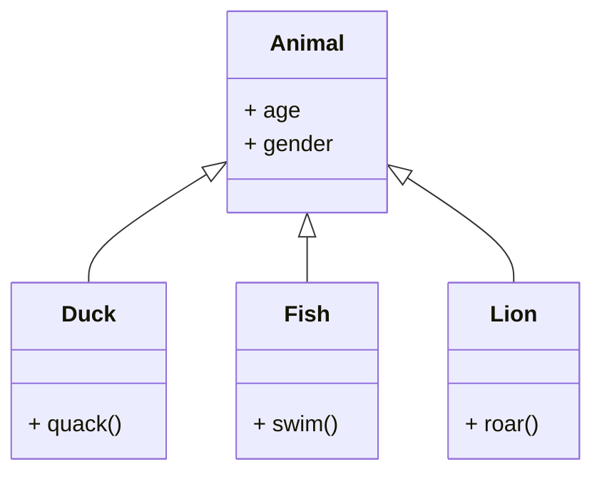

# OOP in C++

## Core Concepts of OOP


### OOP definition:
OOP means Object Oriented Programming i.e. the architecture of a program is decomposed in objects that follow four main principles:
 Encapsulation:
Mechanism of hiding of data implementation by restricting the access to functions and variables.

### Abstraction:
A problem is decomposed in abstract pieces (modules) that ar as independent from each other as possible. The user doesn't know about the implementation of functions inside a module.

### Inheritance:
Classes can inherit from higher level classes, that allows to reuse a lot of code.

### Polymorphism:
Elements can appear in several different forms.

---
<br>

## Class Notation

### Attributes and Methods:
An attribute is a variable (property of the class), a Method is a function that belongs to the class and can change attributes.<br>
Methods that don't change attributes should contain the expression const:
```cpp
void foo() const {}
```

### Private and Public:
Private: and public: are keywords to define the range of attributes and functions of a class. Private elements of a class are only known to other members of the class, public elements are known to everyone.

### Interface:
The Interface of a class (Class definition) with the prototypes of the methods go in the **header file** (.h).\
Example for a Header file (class definition):
```cpp
class MyClass{
    private:
        //attributes
    public:
        //some functions
    private:
        //functions (class-internal use)
}; //Do not forget semicolon!
```

### Header Guard
To avoid errors due to multiple inclusion we create a header guard for header files example file: filename.h:
```cpp
#ifndef FILENAME_H
#define FILENAME_H
// Declarations
#endif
```
The FILENAME must be unique through the whole project!<br>
It is as well possible to generate conditional functionality and to define a custom variable for the compilation, that includes other functions if defined.

### Implementation:
The implementation of the methods as well as variables, that are not attributes of the class go into the ***.cc*** file (Namespace for variables). The interface of the class is included in the implementation:
```cpp
#include "filename.h"
```

### Namespace
Each class has its generic namespace. If variables are defined in the ***.cc*** file, they must be part of the non-named namespace, otherwise they are global variables that everyone has access to.
Definition of a variable in the non-named namespace:
```cpp
namespace{
    int bar;
    void foo();
    //...
}
```
Another possibility is to add the keyword ***static*** in front of the definition.


### This Pointer:
A local variable can mask a variable on a higher level with the same name (e.g. function (method) parameter masks attribute of class) in this case we can use ***this-pointer*** to reach the level from which the function is called (class):
```cpp
private:
    int bar; //attribute of class
public:
    void foo(int bar){
        this->bar = bar; //access to the attribute
    }
```

---
<br>

## Constructors
Constructors are used to to generate instances of a class (i.e. Objects). Constructors are functions without return type.

### Syntax of constructors:
```cpp
class MyClass{
    MyClass(int foo, int bar)
    : attribute1(foo), attribute2(bar) //assignment of attributes
    {}  //body of constructor (validation)
}
```

### Default constructor:
It is possible to create constructors, that assign default values or no values to attributes:
```cpp
MyClass() : attribute(5) {}
```

### Default default constructor:
If no constructor is specified, the compiler generates automatically a constructor that generates a class but assigns no values at all.
It is possible to define manually a default default constructor like this:
```cpp
MyClass() = default;
```

### Remarks:
* A Constructor can call another constructor.
* It is possible to assign default values to attributes in the declaration of the class as well.

### Copy constructor:
Generates a copy of an object. Syntax:
```cpp
MyClass Copy_Name(bar);
```
this calls the standard copy constructor that automatically generates the new instance. A custom prototype is defined like:
```cpp
MyClass(MyClass const& bar) : element(element) {}
```
Usually it is not necessary to define a custom copy constructor. But there are cases where it is very important to define a custom copy constructor e.g. a counter keeps track of the number of objects of an instance. This counter must be incremented by the copy constructor as well as by the constructor.<br>
To avoid the copy of an Object, add ***= delete;*** behind the custom prototype.

---
<br>

## Destructors
Destructors can delete existing objects, which is very important to minimize memory usage. Syntax:
```cpp
~MyClass(){//free memory allocated by class
}
```
A minimal version without body-content is generated automatically by the compiler, if no destructor is defined.

---
<br>

## Attributes and Methods of a Class

### Class Attributes:
We can create attributes that every object of a class has access to. For this purpose we add static in front of the definition of the attribute. Example:
```cpp
static int counter;
```
A class attribute can be private or public and can be accessed from outside of the class with the following syntax:
```cpp
MyClass::Attribute
```
It is as well possible to initialize a such attribute (but not with a constructor):
```cpp
int MyClass::Attribute = 5;
```

### Class Methods:
In the same way we can define methods. The advantage is that this function already exists when no Object of this class has been constructed. This feature is rarely used.

---
<br>

## Operator Overload
It is possible to redefine operators for a class.<br>
Operators (OP) that can be overloaded:

**Arithmetic operators:** +, -, *, / ...<br>
**Logic operators:** and, or, not ...<br>
**Others:** =, ++ ...<br>
**Comparison operators:** ==, <=, >= ...<br>


### External overload:
The operator is defined as **function**. If we want to to use different types with the operator, we must use the external overload!
```cpp
const MyClass operatorOP(MyClass bar1, MyClass const& var2);
```
We add const to avoid notation like: **++(p+q);** or **p+q=f;**<br>
Example for external overload with cout: (It doesn't change the ostream class)
```cpp
ostream& operator<<(ostream& cout, MyClass const& bar);
```
The return type **ostream&** allows notation like: **cout << p << endl;**<br>
Remark: It is also possible to get direct access to private variables of the class with the keyword friend followed by the function prototype inside of the class declaration but it is not recommended!


### Internal overload:
The operator is defined as **method** of the class as followed:
```cpp
//Prototype inside class
class MyClass{
    MyClass operatorOP(MyClass const& bar);
}
//definition outside for readability
MyClass MyClass::operatorOP(MyClass){
    //function body
    return result;
}
```
It is not necessairy to give the first operator of the operation.


### Usage of the two methods:
If we want to change the variables of an object, it is recommended to use the internal overload to avoid the keyword friend. If it is possible to implement the function with the help of methods that already exist, it is recommended to use the external overload.


### Examples for some operators:
How to implement the comparison operator with internal overload:
```cpp
bool operator==(MyClass const&) const; // for p == q
```
How to increment a value with internal overload:
```cpp
MyClass& operator++(); // for p++
```
Addition to the same variable (+=):
```cpp
MyClass& operator+=(MyClass const& bar); // for p += q
// Definition outside of class:
MyClass& MyClass::operator+=(MyClass const& bar){
    // maths
    return *this; // the variable itself
}
```
It is very important that new variables are only created if necessary (performance)<br>


### Operator =:
There exist some special cases where we need to redefine the = operator but normally the default version already does everything that we need. If we want to avoid copies of large classes, it is possible to delete the = operator in the same way as the copy constructor (see copy constructor).


### Swap function:
To Swap two instances of a standard type we can use the swap method:
```cpp
#include <utility>
swap(foo, bar);
```
We have to **overload swap** for MyClass first!

---
<br>

## Inheritance
The main purpose of the principle of inheritance is, that we can define base-classes, that inherit properties from a higher level base-class. 

As we can see in the image, the Classes Duck, Fish and Lion can inherit properties like **age** or **gender** from the super-class Animal but they also have proper methods like **quack()** for the duck. The flashes point in the direction of the super-class, i.e. a more general level.<br>


### Inheritance syntax:
We use the following syntax to create inheritance:
```cpp
class SubClassName: public SuperClassName{
    // Declaration of attributes and methods
};
```

### Protected attributes:
The keyword **protected** (same usage as private and public) allows a protected access to an attribute from all the descending classes.


### Access Mode:
The access mode (in the example above it is public) defines how the derived members of the BaseClass are included in the SubClass:<br>
Access Mode | Public members | Protected members
---|---|---
public:&nbsp;&nbsp;|-> Public,&nbsp;&nbsp;|-> Protected
protected:|-> Protected,|-> Protected
private:|-> Private,|-> Private

**Note:** The scope of private members of the superclass can't be changed with the access mode!<br><br>


### Maskage:
It is possible to mask the methods of a super-class so only some of the base-classes can use the method. For this purpose, we can just adapt the definition of the function in a base-class. If we specify a specialized method for one (sub-) class, the other classes at the same level still use the general method of the super-class. Even if it is possible, it is not recommended to mask attributes due to confusion. Meanwhile for methods this is a very common practice!<br>
It is also possible to use the general method with a class for which a specialized method is defined:
```cpp
BaseClass::methodName(int bar); // Calls general method
methodName(int bar); // Calls specialized method
```

### Constructors:
The constructor of a subclass must call the constructor of the base-class to correctly initialize the attributes. The syntax is the following:
```cpp
SubClass(int x, int y)
    : SuperClass(x), attribute(y){} // constructor of SuperClass is called
```
If the super-class has a default constructor this is not necessary.<br>
The constructor of a base-class always calls the constructor of the super-class until the top level class is reached. This class then constructs his attributes and after that the attributes of the sub-classes are added in descending order. The destructors are called in the reverse order.<br>
The copy constructor has to be redefined as well to call the copy constructors of the super-class.


### Constructor inheritance:
Constructors are not automatically inherited but it is possible to enforce the inheritance of the constructors of the super-class as followed:
```cpp
using SuperClass::SuperClass;
```
This method is not recommended because the constructors of the super-class don't initialize the attributes of the subclass.


### Deep Copies:
If some class-members are pointers, the constructor must allocate new memory space for values that it assigns with the keyword **new**:
```cpp
: height(new double = bar), //...
```
In this case it is possible that a copy of an object (e.g. for a function) that is deleted after the call of the function deletes the allocated memory. This can produce memory leaks (segmentation fault).<br>
In this case it is possible to create **"Deep copies"** that copy the pointed memory as well. We have to redefine the copy constructor as follows:
```cpp
MyClass(const MyClass& bar)
: height(new double(*(bar.attribute))), //...
```
The created object is a deep copy with its own height that is not deleted if we delete obj or the copied element.


### Remark:
To avoid the mentioned problems it is also necessary to redefine the **operator=** in the same way. The destructor of the class must be redefined as well and has to delete all the allocated memory space with the keyword **delete** otherwise we take the risk of an overflow.

---

## Polymorphism
The last big principle of OOP is called polymorphism which means that the same code can adapt to the types that are given to it. The basic principle of Polymorphism comes from the fact that in an inheritance structure, the type is inherited what means that a subclass is also an instance of its base-class. If the same method can apply to different sub-classes we need to use what is called dynamic link resolution which can determine at runtime what kind of object is given as input and which function needs to be called.


### Virtual methods:
If we use dynamic resolution, we have to define virtual methods (definition in prototype) that are stored in v-tables. It is essential that the argument passed to virtual functions are pointers or references otherwise the polymorphism doesn't work because a local copy of the base-class object is created.
```cpp
// virtual function prototype
virtual void foo(object& bar);
```


### Virtual destructors:
Destructors of inheritance structures ***need to be defined*** as virtual to avoid memory leaks. Note that on the other hand a ***constructor can't be virtual*** 


### Overloading:
Overloading means that we give different implementations of a function with the same name so that it supports different types as input arguments.


### Shadowing:
We speak of ***"Shadowing"*** if a method is redefined with the help of locality (e.g. namespace). 


### Overriding:
"Overriding" consists of redefining virtual methods in an objects that inherits a virtual method (the function will be called if this subclass is passed to it by reference), the syntax is the following:
```cpp
// overriding
virtual void foo(MyClass& bar) override;

// finalizing:
virtual void foo(MyClass& bar) final;
```
The final keyword doesn't allow further redefinitions of the function in descending classes. <br>
**Note:** the override keyword is optional but in terms of readability it is crucial to use it!

## Abstract Classes (notion of pure virtual functions)
Sometimes it is not possible to define a general method in a base class. In this case it is possible to create a ***pure virtual function*** as follows:
```cpp
virtual void foo() = 0;
```
This method is not yet implemented and all descending classes ***must*** implement it. <br>
A class that contains at least one pure virtual method is called ***Abstract class*** and can't be instantiated. Meanwhile subclasses that implements ***all*** the pure virt. methods can obviously be created.


### Notion of an Interface (not in MOOC):
The equivalent to an interface in Java or C# is an abstract class that consists only of pure virtual methods without any implementation.

## Heterogenous Collection
A heterogenous collection is a set of objects of the same superclass that are treated in a polymorphous manner. This allows a more generic way of treating object and therefore a higher level of encapsulation. This approach consists in having a vector of pointers of the superclass that contains different objects whose functions can be called due to the dynamic link resolution. <br>
**Note:** it can be better to use smart pointers to treat objects like this because we need to ensure that the objects are not destroyed before we delete its pointer. In this case the dynamical allocation really comes in handy!


### Unique Pointers:
Unique pointers ensure that only one pointer at a time points to an object.
```cpp
// include:
#include <memory>

// unique pointer syntax
std::unique_ptr<MyClass> ptr = nullptr;

// moving the pointer (it cannot be copied)
return make_unique<MyClass>(new bar);
// or
std::unique_ptr ptr_2 = std::move(ptr);
```


### Memory handling:
C style pointers can provide a less good integrity of data because we must ensure that the objects pointed to live longer than the pointer and we have to take care of different pointers pointing to our objects. Further we have to dislocate memory allocated with C style pointers in order to avoid memory leaks. Therefore if we use C style pointers we should think of redefining the copy constructor of the Class in order to prevent different pointers pointing on the same object. 

---

## Multiple inheritance
A Class can directly inherit from multiple classes:
```cpp
class SubClass : public SuperClass1, private SuperClass2 //...
```
**Note:** the inheritance order of the classes is important in the construction and destruction of the class!


### Construction and Destruction:
The construction happens in the same manner as in the simple inheritance: 
```cpp
SubClass(foo, bar)
    : SuperClass1(foo), SuperClass2(bar) //initialization list...
```
If a Superclass has a default constructor, it must not be called but it is good practice to do it anyway.


### Shadowing in MI context:
A problem that can occur is that a class inherits from to SuperClasses that have a function with the same name (even if the input types differ). One solution to this is using the :: operator, a more common practice is to define in the SubClass which one of the methods should be inherited with the help of the keyword ***using***. 
```cpp
using SuperClass::foo; // foo can be a method or an attribute (no parentheses)
```
A third possible solution would be to redefine the method in the subclass where it is as well possible to call the two parent methods.


### Virtual class:
It is possible that a class can indirectly inherit multiple times from the same SuperSuperClass. In this case we possibly don't want to have all the attributes defined 2x in the SubClass. To harm that multiple inclusion of attributes, we can create a virtual SuperClass:
```cpp
class SubClass : public virtual SuperClass
```
**Note:** this is not an abstract class or interface!


### Virtual inheritance and Constructor:
Classes that virtually inherit of a SuperSuperClass must directly call the constructor of the SuperSuperClass in their constructor to initialize an object before it calls the other SuperClass constructors! The copy constructors are going to be called in the same order as well.