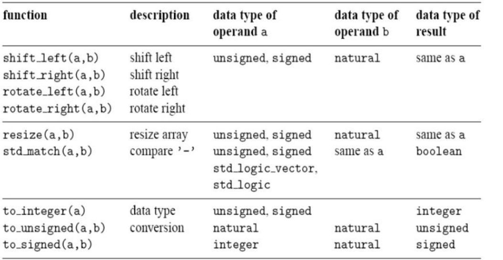

# VHDL cheatsheet

## Libraries and Packages
Include package from a libary:
```vhdl
library library_name;
use library_name.package_name.reference;
```
Reference can be a function name, a constant name or ```all``` to use the whole package.

Project specific packages are compiled into the ```WORK``` library and are used like this:
```vhdl
use WORK.my_package.all;
```

### Important libraries
```vhdl
library ieee;
use ieee.std_logic_1164.all;
use ieee.numeric_std.all;
```

### Package declaration
```vhdl
package package_name is
    -- content & constants / types / functions
end package package_name;
```

## Entities
An entity is declarated as follows:
```vhdl
entity entity_name is
    generic(
        generic_1_name : generic_1_type;
        generic_2_name : generic_2_type
    );
    port(
        port_1_name : port_1_dir port_1_type;
        port_2_name : port_2_dir port_2_type
    );
end entity_name;
```
Ports: interface of the component, inputs and ouputs. Port directions can be: ```in, out, inout, buffer```

Generics: Instance specific parameters that resolve to a constant known at compile time

The port and generics sections are optional

## Architecture
Architecture declaration defines its name, the name of the associated entity and the architecture itself:
```vhdl
architecture architecture_name of entity_name is
    -- signals to be used are declared here
begin
    -- Insert VHDL statements to assign outputs to
    -- each of the output signals defined in the
    -- entity declaration.
end architecture_name;
```

## Signals
Signals are wires on the hardware, they connect ports and are declared in the architecture preamble:
```vhdl
signal signal_name : signal_type;
```

### Constants:
Constants are special signals that represent fixes values and can be declared in Packages, as generics in an entity or as constants in the preamble of an architecture, they can be derived expressions from other constants.
```vhdl
constant constant_name : constant_type := expression;
```

### Built-in data types:
VHDL supports 6 native scalar data types:

1)  Bit     : 1 or 0
2)  Boolean : true / false
3)  Integer : defined by a range, default 32 bit
4)  Char    : 8 bit integer
5)  Real    : floating point number
6)  Time    : for modeling of delays in [ps, ns]

Not all of those types can be used in synthesis, time has no hardware equivalent and real does introduce a lot of complexity

### Extended data type std_logic:
Often used, possible values are:

1) Logic-0 : '0'
2) Logic-1 : '1'
3) Don't care : '-'
4) High impedance : 'Z'
5) Unknown : 'X' (for simulation)
6) Weak-0 : 'L'
7) Weak-1 : 'H'
8) Weak-X : 'W'
9) Uninitialized : 'U' (for simulation)

The values are encoded as characters

### Logic Vectors:
STD_LOGIC_VECTOR as array of type std_logic (don't forget to include the ieee library)
```vhdl
signal signal_name : STD_LOGIC_VECTOR(high downto low);
```
Note high here is size-1 if low is 0

Operations:
```vhdl
target_array_object(index_range) <= “010-10-”
target_array_object(index_range) <= base_type_object_1 & base_type_object_1 -- concatenation
```

### Array types:
Arrays can be defined as follows:
```vhdl
type array_type_name_1 is array (low to high) of base_type;
type array_type_name_2 is array (high downto low) of base_type;
type array_type_name_3_2D is array (integer range <>) of array_type_name_2;
-- signal declaration
signal signal_1_name : array_type_name_1;
signal signal_2_name : array_type_name_3(low to high);
```
Operations:
```vhdl
target_array_object(index) <= base_type_object;
target_array_object <= (value1, value2, ...);
target_array_object <= (idx_1=>value_1, idx_2=>value_2, …);
target_array_object <= (idx_1=>value_1, idx_2|idx_3=>value_2, …);
target_array_object <= (idx_1=>value_1, others=>value_2); -- fill the remaining
```

### Signed and Unsigned types:
Binary representation for numbers from IEEE numeric_std library
```vhdl
signal name_u : unsigned(size-1 downto 0);
signal name : signed(size-1 downto 0);
```
Arithmetic operations:


Type conversions (no hardware ressources required):
```vhdl
unsigned(std_logic_vector); --for example
```

### Concurrent signal assignments:
```vhdl
signal <= expression;
```
Never assign more than one value to a signal in one concurrent statement!

### Boolean operators:
Valid operators are: ```AND, OR, NOT, XOR, NAND, NOR, XNOR``` They can be used like:
```vhdl
signal <= signal_1 <boolean_operator> signal_2;
```

### Signal naming convention:


## Component
A component is one instance of an entity, it must be declared in the preamble and instantiated in the body of the architecture in which it is used:

Declared of a component for the entity [declared here](#entities)
```vhdl
component component_name is
    generic (
        generic_1_name : generic_1_type;
        generic_2_name : generic_2_type
    );
    port (
        port_1_name : port_1_dir port_1_type;
        port_2_name : port_2_dir port_2_type
    );
end component;
```

Instantiation:
```vhdl
begin -- architecture body
    -- Component instantiation:
    instance_1_name : component_name
    GENERIC MAP (
        generic_1_name => CONSTANT_EXP_1_1,
        generic_2_name => CONSTANT_EXP_1_2
    )
    PORT MAP (
        port_1_name => port_1_1_signal,
        port_2_name => port_1_2_signal
    );
    -- Or anther way:
    instance_2_name : component_name
    GENERIC MAP ( CONSTANT_EXP_2_1, CONSTANT_EXP_2_2)
    PORT MAP ( port_2_1_signal, port_2_2_signal );
end architecture_name;
```

## Conditional statements:
Rule: every conditional statement must be complete, otherwise we create latches which is not allowed in synchronous RTL design.

### If else:
```vhdl
if boolean_expression then
    signal_1 <= expression
elsif boolean_expression_2 then
    signal_1 <= expression_2
else
    signal_2 <= expression_3
end if;
```

### Conditional assignment:
```vhdl
target_signal <= expression_1 when boolean_expression_1 else
    expression_2 when boolean_expression_2 else
    …
    expression_N; -- else statement
```

### With select statement:
Used for multi-valued conditions
```vhdl
with cond_signal select
    target_signal <=
    expression_1 when constant_1,
    expression_2 when constant_2,
    …
    expression_N when others;
```

## Processes
A process can contain sequential statements, they are evaluated one after another. The process runs when any signal in the senitivity list changes.
```vhdl
process_name: process (…)
begin
    target_signal_1 <= expression;
    target_signal_1 <= expression_2;
end process process_name;
```
Multiple assignments are possible, the signal keeps the value that was last assigned to it. Assignments must be complete, otherwise latches are generated. This can be avoided with default assignments. Assigning don't care by default minimizes the logic.

### Case statement
Can be used in processes to evaluate non-binary conditions:
```vhdl
case expression is
    when choice_1 =>
        sequential_statement_1;
        sequential_statement_1a;
        …
    when choice_2 =>
        sequential_statement_2;
        …
    when others =>
        sequential_statement_3;
        …
end case;
```

## Describing edge triggered registers (flipflops)
Flipflop that triggers on positive clock edge and has an asynchronous reset
```vhdl
-- Clocked Process, generating a FlipFlop behavior
p_seq: process (clock_signal, async_reset_signal) is
begin
    if async_reset_signal = '1' then
        present_state_signal <= constant;
    elsif clock_signal’event and clock_signal = '1' then
        present_state_signal <= next_state_signal;
    end if;
end process p_seq;
```

## State machines (FSM)
Use a Flipflop to store the present state as shown [above](#describing-edge-triggered-registers-flipflops)
Use a process for the output and transition logic and enumerated types for the states:
```vhdl
architecture rtl of my_fsm_states is
    -- type declarations for FSM states
    type state_type is (StateA, StateB, StateC);
    -- signal declaration
    signal STATExDN, STATExDP : state_type;
begin

t_o_logic: process (STATExDP, FSM_input_signals) is
begin
    -- Default assignments
    STATExDN <= STATExDP;
    FSM_output_signal_1 <= default_output_expression;
    case STATExDP is
        when state_1 =>
        -- Conditional statements based on inputs
        if condition_1_on_FSM_input_signals then
            ...
        end if;
        when state_2 =>
        ...
    end case;
end process t_o_logic;
```

## Simulation Testbenches
### Cycle accurate simlation:
Simple but only useful for small blocks, proceeds cycle by cycle
```vhdl
p_ALL : process ( )
begin
-- APPLY STIMULI
-- CHECK RESPONSES
-- GO to NEXT CYCLE
end process p_ALL;
```

### Non cycle accurate simulation:
Defines only the functional stimuli and the responses but not their exact timing, this approach is much more flexible. Done using different processes that run when the inputs change.

### Time and Delays
Only usable in simulation, not on hardware
```vhdl
-- change signal after time delay:
signal <= exmpression after time;
-- retain and propagate changes after time delay:
signal <= transport expression after time;
-- wait for any change in any of the listed signals:
wait on signal_1, signal_2, ...;
-- wait until a condition is fullfilled:
wait until <boolean_expression>;
-- wait for amount of time:
wait for waiting_time;
-- wait forever:
wait;
```

### Assertions
Check expression and report the string to simulator console, severity levels are ```NOTE, WARNING, ERROR, FAILURE``` failure usually aborts the simulation.
```vhdl
assert <boolean_expression> report string severity severity_level;
```

### Creating a clock and a reset
Best practice is to define a clock and a reset like this:
```vhdl
constant CLK_PERIOD : time := 10ns;
constant CLK_HIGH : time := CLK_PERIOD / 2;
constant CLK_LOW : time := CLK_PERIOD / 2;
...
begin -- architecture
    -- Clock Generation
    p_clk : process
    begin
        CLKxC <= ‘0’;
        wait for CLK_LOW;
        CLKxC <= ‘1’;
        wait for CLK_HIGH;
    end process p_clk;

    -- Async Reset Generation
    p_rst : process
    begin
        RSTxRB <= ‘0’;
        wait until CLKxC’event and CLKxC=‘1’;
        wait until CLKxC’event and CLKxC=‘1’;
        wait for 1ns;
        RSTxRB <= ‘1’;
        wait;
    end process p_rst;
    ...
```

### Applying stimuli and checking responses
Can be done in one common process if both steps are tightly related with short latency or in independent processes if there are large latencies or a decoupled timing.
Example for hardcoded stimuli and responses:
```vhdl
-- Stimuli Application
p_stim : process
begin
    INPUTxS <= ‘0’; -- Initial Input during Reset

    wait until CLKxC’EVENT and CLKxC=‘1’ and RSTxRB = ‘1’;
    wait for STIM_APPL_DELAY;
    INPUTxS <= ‘1’; -- First cycle
    
    wait until CLKxC’EVENT and CLKxC=‘1’;
    wait for STIM_APPL_DELAY;
    INPUTxS <= ‘0’; -- Second cycle
    
    wait;
end process p_stim;

-- Response Checking
p_resp : process
begin
    wait until CLKxC’EVENT and CLKxC=‘1’ and RSTxRB = ‘1’;
    wait for RESP_CHK_DELAY;
    assert OUTxS = exp_response_1 REPORT “Mismatch 1” severity FAILURE;
    
    wait until CLKxC’EVENT and CLKxC=‘1’;
    wait for RESP_CHK_DELAY;
    assert OUTxS = exp_response_2 REPORT “Mismatch 2” severity FAILURE;
    
    wait;
end process p_stim;
```

See the [slides here](https://moodle.epfl.ch/pluginfile.php/2841887/mod_resource/content/6/DSD-Lecture-4-VHDL-for-Testbenches.pdf#page=17) for a more sophisticated version with Response acquisition check.


## Sequential code in processes
This can make the implementation of algorithms very convenient but it often results in unnecessairy complex hardware and there are a lot of pitfalls. Example code:
```vhdl
process (a) is
    variable acc, q, r : unsigned(7 downto 0);
    begin
        acc := unsigned(a(0));
        for i in 1 to 3 loop
            acc := acc + unsigned(a(i));
        end loop;
        q := "000" & acc(7 downto 3); -- /8
        r := "00000" & acc(2 downto 0); -- rem 8
        if r > 3 then
            q := q + 1;
        end if;
        outp <= std_logic_vector(q);
end process;
```