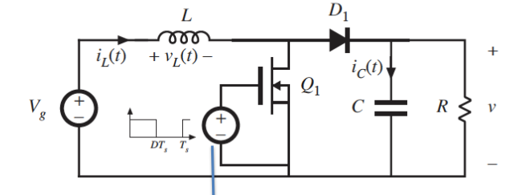
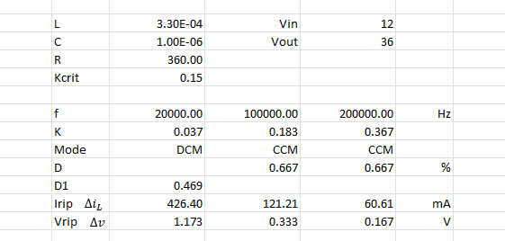

# Power converter for LED lighting

## Theoretical design:

1) Boost converter

2) $$ P = UI = \frac{U^2}{R} \implies R = \frac{U^2}{P} = \frac{36^2}{3.6} \frac{\text{V}\cdot\text{V}}{\text{W}} = 360 \Omega$$

3) 

Formulas: 

K: $\quad\displaystyle K = \frac{2L}{RT_s} = \frac{2fL}{R}$

Critical K: $\quad\displaystyle K_{\text{crit}} = D(1-D)^2\quad$ with $\quad\displaystyle\max_{0\leq D \leq 1}K_{\text{crit}} = \frac{4}{27}$

Duty cycle in CCM: $\quad\displaystyle D = \frac{V_{out} - V_{in}}{V_{out}}$

Duty cycle in DCM: $\quad\displaystyle D_1 = \sqrt{\left(\left(\frac{2V_{out}}{V_{in}}-1\right)^2-1\right)\frac{K}{4}}$

Ripple current: $\quad\displaystyle\Delta i_L = \frac{V_g}{2L} DT_s\quad$ resp. $D_1$ for discontinuous mode

Ripple tension: $\quad\displaystyle\Delta v = \frac{V}{2RC}DT_s\quad$ resp. $D_1$ for discontinuous mode

## Simulation
